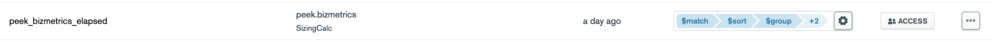

**Realm Functions**


**Realm Triggers**


**Generate Orders**

```js
exports = async function () {
  var sampleFoodColl = context.services
    .get("mongodb-atlas")
    .db("sample_food")
    .collection("orders");
  var newFoodColl = context.services
    .get("mongodb-atlas")
    .db("food")
    .collection("orders");
  var locationColl = context.services
    .get("mongodb-atlas")
    .db("sample_restaurants")
    .collection("restaurants");

  var orders = await sampleFoodColl
    .aggregate([
      {
        $sample: {
          size: Math.random() * 5 + 1,
        },
      },
      {
        $addFields: {
          orderTime: new Date(),
        },
      },
      {
        $project: {
          item: "$Item Name",
          qty: "$Quantity",
          price: "$Product Price",
          orderTime: "$orderTime",
          status: "submitted",
        },
      },
    ])
    .toArray();

  var locations = await locationColl
    .aggregate([
      {
        $sample: {
          size: orders.length,
        },
      },
      {
        $project: {
          address: 1,
          _id: 0,
        },
      },
    ])
    .toArray();

  for (var i = 0; i < orders.length; i++) {
    orders[i].address = locations[i].address;
  }

  console.log(JSON.stringify(orders));

  newFoodColl.insertMany(orders).then((doc) => {
    console.log(doc);
  });

  return;
};
```

**Move Order to Processing Status**

```js
exports = async function () {
  var newOrdersCollection = context.services
    .get("mongodb-atlas")
    .db("food")
    .collection("orders");

  for (var i = 0; i < Math.random() * 4; i++) {
    await newOrdersCollection.updateOne(
      { status: "submitted" },
      { $set: { status: "processing" } }
    );
  }

  return;
};
```

**Move Processed Orders to Out For Delivery**

```js
exports = async function () {
  var newOrdersCollection = context.services
    .get("mongodb-atlas")
    .db("food")
    .collection("orders");

  for (var i = 0; i < Math.random() * 3; i++) {
    await newOrdersCollection.updateOne(
      { status: "processing" },
      { $set: { status: "outfordelivery" } }
    );
  }
  return;
};
```

**Deliver the Orders**

```js
exports = async function () {
  var newOrdersCollection = context.services
    .get("mongodb-atlas")
    .db("food")
    .collection("orders");

  for (var i = 0; i < Math.random() * 3; i++) {
    await newOrdersCollection.updateOne(
      { status: "outfordelivery" },
      { $set: { status: "delivered" } }
    );
  }
  return;
};
```

**Public Dashboard Links are here:**

- [Orders Activity Dashboard](https://charts.mongodb.com/charts-ankur_raina-jqukv/public/dashboards/26f81f0c-66a7-446b-ba80-fbf86475f9e4)

**Elapsed Time was calculated using the following aggregation pipeline in the Data Source of Charts**



This can also be achieved using Window Functions which I'll update soon.

```js
[
  {
    $match: {
      $expr: {
        $gt: [
          "$changeTime",
          {
            $subtract: ["$$NOW", 1 * 60 * 60 * 1000],
          },
        ],
      },
    },
  },
  { $sort: { _id: -1, changeTime: 1 } },
  {
    $group: {
      _id: "$_id",
      submitted: { $first: "$changeTime" },
      delivered: { $last: "$changeTime" },
    },
  },
  {
    $project: {
      elapsed: {
        $dateDiff: {
          startDate: "$submitted",
          endDate: "$delivered",
          unit: "minute",
        },
      },
    },
  },
  {
    $match: {
      elapsed: { $gt: 15 },
    },
  },
];
```

**References:**

- I have used [Takeaway Food Orders](https://www.kaggle.com/henslersoftware/19560-indian-takeaway-orders/version/4) from Kaggle for item names and few other fields
- I have used [MongoDB's Sample Restaurants Dataset](https://docs.atlas.mongodb.com/sample-data/sample-restaurants/) for picking the locations
